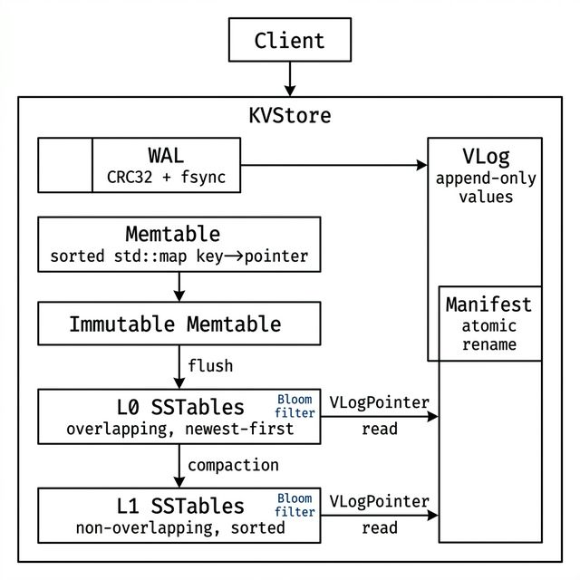
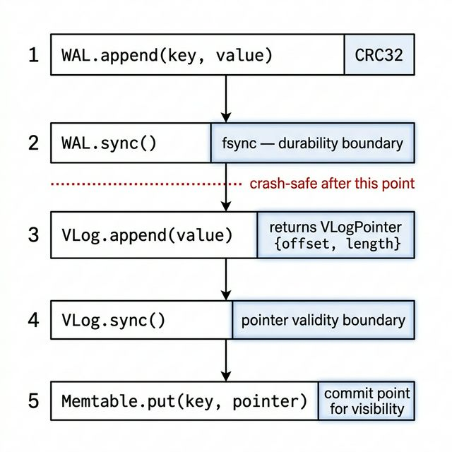
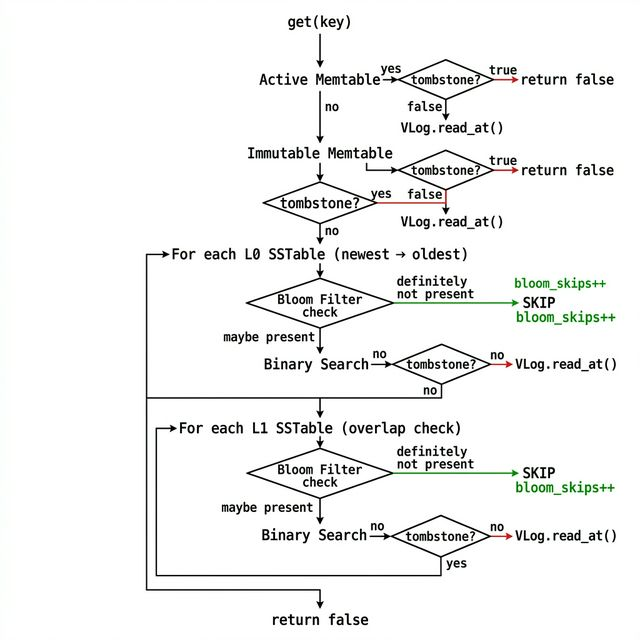

# ForgeLSM

**A WiscKey-style LSM storage engine built from scratch in C++20.**

ForgeLSM separates keys from values at the storage layer — keys live in a sorted LSM tree (Write-Ahead Log → Memtable → SSTables), while values live in a separate append-only Value Log. This architecture trades a small read indirection for dramatically lower write amplification on SSDs, where random reads are fast but random writes destroy NAND cells.

The engine is crash-safe, fully durable, and implements multi-level compaction, LSM-driven garbage collection, per-SSTable Bloom Filters with `mmap` support, and a built-in benchmarking harness with latency percentile tracking.

[](https://github.com/Juixe7/ForgeLSM/actions/workflows/ci.yml)
[](#testing)
[](#build)
[](#deployment)

---

## Engine Introspector Dashboard

ForgeLSM ships with a **real-time observability dashboard** — the same class of operational tooling that production storage engines like RocksDB and TiKV expose. The dashboard is implemented as a minimal HTTP server built on raw POSIX/Winsock2 sockets (~300 lines of C++, zero external dependencies) and served from the same binary as the engine.

<p align="center">
  
</p>

### What the Dashboard Shows

| Panel | Data |
|-------|------|
| **Write Amplification Gauge** | Real-time ratio of storage bytes written to user bytes written. Bounded at ~2.0× by the WiscKey key-value separation architecture. |
| **Read Amplification Gauge** | `(SST binary searches + VLog reads) / get() calls`. Bloom filters drive this toward 1.0×. |
| **LSM Tree Visualization** | Live count of Memtable entries, L0 SSTable files, L1 SSTable files, compaction pressure %, and flush proximity bar. |
| **Bloom Filter Detail** | SSTables considered, bloom skips, actual binary searches executed, and skip rate percentage. |
| **Engine Health** | WAL taint status, memtable fill %, L0 compaction pressure, and overall health indicator. |
| **Interactive Console** | `put`, `get`, `del` commands that fire HTTP API calls and display results with live metric refresh. |
| **Benchmark Runner** | Trigger random\_write / sequential\_write / random\_read / mixed workloads (up to 2,000 ops) and display throughput + amplification results. |

### Running the Dashboard

```bash
# Build
mingw32-make          # Windows (MinGW)
# or
make                  # Linux / macOS

# Start the introspector dashboard
./flsm.exe web        # Windows
./flsm web            # Linux / macOS

# Open in browser
# http://localhost:8080
```

Optional: specify a custom port:
```bash
./flsm web 9090
```

### HTTP API Reference

The dashboard is backed by a typed JSON API. All endpoints are directly callable with `curl`:

```bash
# Engine metrics + derived ratios
curl http://localhost:8080/api/metrics

# LSM tree state
curl http://localhost:8080/api/lsm-state

# Write a key-value pair
curl -X POST http://localhost:8080/api/put \
     -H "Content-Type: application/json" \
     -d '{"key":"hello","value":"world"}'

# Read a value
curl -X POST http://localhost:8080/api/get \
     -H "Content-Type: application/json" \
     -d '{"key":"hello"}'

# Delete (tombstone)
curl -X POST http://localhost:8080/api/delete \
     -H "Content-Type: application/json" \
     -d '{"key":"hello"}'

# Run a benchmark
curl -X POST http://localhost:8080/api/bench \
     -H "Content-Type: application/json" \
     -d '{"type":"random_write","ops":500}'
```

---

## Deployment

### Docker (Recommended)

```bash
# Build the image
docker build -t forgelsm .

# Run the dashboard
docker run -p 8080:8080 forgelsm

# With persistent data volume
docker run -p 8080:8080 -v forgelsm_data:/app/flsm_production forgelsm
```

### Docker Compose

```bash
docker compose up -d
# Dashboard available at http://localhost:8080
# Engine data persisted in a named volume
```

### Railway (Cloud)

The repository includes a GitHub Actions workflow (`.github/workflows/ci.yml`) that automatically deploys to [Railway](https://railway.app) on every push to `main`:

1. Fork the repository
2. Create a Railway project from GitHub
3. Add `RAILWAY_TOKEN` to your repository secrets
4. Push to `main` — the workflow builds, tests, and deploys automatically

---


## Why This Problem Is Hard

Building a correct storage engine — not just a fast one — requires solving several problems simultaneously:

**Write amplification kills SSDs.** Traditional LSM engines (LevelDB, RocksDB) write values into SSTables alongside keys. Compaction then rewrites those values repeatedly as data moves between levels. A 100-byte value might be physically written 10–30x over its lifetime. WiscKey separates values from the sorted structure entirely, reducing write amplification to near 1x for the sort path.

**Crash consistency is non-negotiable.** A power failure during any write operation — WAL append, VLog append, SSTable flush, compaction, or manifest update — must leave the system in a recoverable state. Every metadata boundary in ForgeLSM is protected by `fsync` before the next step proceeds. The manifest uses atomic rename to ensure SSTable visibility is all-or-nothing.

**Compaction correctness has subtle invariants.** When merging L0 SSTables into L1, the engine must guarantee newest-write-wins across overlapping key ranges, correctly propagate tombstones without prematurely dropping them, and produce strictly non-overlapping L1 output files — all while atomically updating the manifest so a crash mid-compaction doesn't corrupt the key space.

**Garbage collection in a separated-value architecture is fundamentally different.** The Value Log accumulates stale values as keys are overwritten. Classical GC scans the VLog looking for live pointers, but this is fragile — it requires the VLog to contain keys, which violates value-only semantics. ForgeLSM's GC instead walks the LSM tree to discover live pointers, then rewrites only those values through the standard write path. This guarantees that no stale pointer can ever be resurrected.

---

## Architecture

<p align="center">
  
</p>

### Component Breakdown

| Component | Responsibility | Key Invariant | Failure Mode |
|-----------|---------------|---------------|--------------|
| **WAL** | Durability for in-flight writes. CRC32-validated records with tombstone encoding (`value_size = 0xFFFFFFFF`). Multi-file rotation with monotonic IDs. | Replay stops at first corrupt/incomplete record — never serves partial data. 64 MiB allocation guard prevents OOM from corrupted size fields. | Corrupt tail is truncated; WAL is marked `tainted`. Valid prefix entries are recovered. |
| **VLog** | Stores raw values in append-only format (`[value_size][value_bytes]`). Separates values from the sorted key structure. | Offset tracked in user-space (`current_offset_`), never derived from `lseek()`. Dual file descriptors: one for append, one for reads. | Partially written values produce short reads that return `false`. No key stored in VLog — by design. |
| **Memtable** | In-memory sorted key→`VLogPointer` map. `byte_size()` tracking for flush threshold decisions. | All lookups are O(log n). Flush threshold is 4 MiB of estimated byte size. | Memory-only; durability depends entirely on WAL. |
| **SSTable** | Persistent sorted key→pointer files with embedded Bloom Filter. Binary search on sorted entries. | CRC32 checksum covers data section + bloom section. Footer stores `entry_count`, `bloom_offset`, `bloom_size`, `checksum`. | Checksum mismatch rejects the entire file. Load returns `false`; the SSTable is not added to the read path. |
| **Manifest** | Tracks which SSTables belong to L0 and L1. Versioned for consistency. | Atomic commit: write temp → `fsync` → rename. SSTable visibility is all-or-nothing. | Crash during write leaves a `.tmp` file. Recovery ignores temp files and loads the last committed manifest. |
| **Compaction** | Merges all L0 files + overlapping L1 files into new non-overlapping L1 files. | Newest-write-wins via `std::map::insert` (first insert wins, iterate newest-to-oldest). Tombstones only dropped if key doesn't exist in input L1 files. | Crash before manifest commit: old SSTables remain valid. Crash after: new SSTables are visible. |
| **GC** | Reclaims stale values from VLog by scanning the LSM tree (not the VLog). | `seen_keys` set ensures only the newest version of each key is considered live. GC writes go through `put()` — standard write path. Subtracts internal bytes from user metrics. | Old VLog deleted only after all live values rewritten and file handle released. |
| **Bloom Filter** | Probabilistic membership test per-SSTable. Derived double hashing from MurmurHash64A. | False negatives are impossible by construction. `may_contain()` returns `true` if filter is uninitialized (safe fallback). | Bloom bytes are included in the SSTable checksum. Corruption triggers full SST rejection. |

---

## Write Path

<p align="center">
  
</p>

Every `put(key, value)` follows this exact sequence. The ordering is not arbitrary — violating it causes data loss.

```
1. WAL.append(key, value)     ← full record with CRC32
2. WAL.sync()                 ← fsync — durability boundary
3. VLog.append(value)         ← returns VLogPointer {file_id, offset, length}
4. VLog.sync()                ← fsync — pointer validity boundary
5. Memtable.put(key, pointer) ← only if steps 1–4 succeed
```

**Why this order:**
- If the process crashes after step 2 but before step 5, the WAL contains a durable record. On recovery, replay reconstructs the memtable by re-appending to VLog.
- If VLog append succeeds but `sync()` fails, the pointer is not inserted into the memtable. The value bytes may exist on disk but are unreferenced — effectively a harmless leak, not a correctness violation.
- The memtable update is the **commit point for visibility**. A key is not readable until the pointer is in the memtable.

**Delete path:** `delete_key(key)` appends a tombstone record (`value_size = 0xFFFFFFFF`) to the WAL and inserts a sentinel `VLogPointer` with `offset = UINT64_MAX, length = 0` into the memtable. The tombstone propagates through flush and compaction.

---

## Read Path

<p align="center">
  
</p>

Every `get(key)` walks the following hierarchy, stopping at the first match:

```
1. Active Memtable          ← in-memory, newest writes
2. Immutable Memtable       ← frozen during flush, still in-memory
3. L0 SSTables (newest → oldest)
   └─ Bloom check → if NO → skip entirely
   └─ Binary search → if found → VLog read
4. L1 SSTables (key range overlap check)
   └─ Bloom check → if NO → skip entirely
   └─ Binary search → if found → VLog read
5. Return false (key not found)
```

**Tombstone short-circuit:** If any level returns a `VLogPointer` where `is_tombstone()` is true, the read immediately returns `false`. This prevents deleted keys from being "found" in older levels.

**Bloom Filter impact:** For keys not present in an SSTable, the Bloom Filter eliminates the binary search entirely. With a 1% false positive rate and `k = 7` hash functions, on a dataset with 10 L0 files, a missing-key lookup drops from 10 binary searches to ~0.1 on average.

**Read amplification tracking:** The engine tracks `sst_considered` (total SSTables evaluated), `bloom_skips` (SSTables skipped by Bloom), `sst_searches` (actual binary searches performed), and `vlog_reads` (value fetches from disk).

---

## Crash Recovery

On startup, `KVStore::recover()` executes:

1. **Load Manifest** — reads MANIFEST file to discover which SSTables are valid in L0 and L1. Temp manifest files (`.tmp`) are ignored.

2. **Scan WAL files** — discovers all `wal_NNNNNN.log` files, sorts by sequence number.

3. **Replay each WAL** — for every record:
   - Read `key_size`, `value_size`, `checksum`, key bytes, value bytes
   - Compute CRC32 over the header + payload
   - If checksum matches: reconstruct VLogPointer via VLog append, insert into memtable
   - If checksum fails or record is incomplete: stop replay, mark WAL as `tainted`
   - If `value_size == 0xFFFFFFFF`: record is a tombstone — insert sentinel pointer

4. **Load SSTables** — for each sequence in the manifest, call `SSTableReader::load()` which validates footer checksum and initializes the Bloom Filter.

**Key guarantee:** A crash at any point during the write path, flush, compaction, or GC leaves the system in a consistent state. The WAL acts as the source of truth for in-flight writes, and the manifest acts as the source of truth for SSTable visibility.

---

## Compaction

Compaction merges all L0 SSTables with overlapping L1 SSTables into new, non-overlapping L1 files.

```
Trigger: L0 file count > 15 (backpressure threshold)

1. Snapshot L0 sequences from manifest
2. Compute global key range across all L0 files
3. Find overlapping L1 files (key range intersection)
4. Collect L1 keys (for safe tombstone eviction)
5. K-way merge: iterate newest L0 → oldest L0 → L1
   └─ std::map::insert ignores duplicates → newest version wins
6. Filter tombstones: drop only if key not in input L1 files
7. Write new L1 SSTables (chunked by 4 MiB threshold)
8. Atomic manifest commit (write → fsync → rename)
9. Delete old L0 and consumed L1 files
10. Reload SSTable state
```

**Why tombstone safety matters:** If a tombstone for key `X` exists in L0 and key `X` also exists in an L1 file not included in this compaction, dropping the tombstone would resurrect the deleted key. The engine only drops tombstones when no version of the key exists in the input L1 files.

---

## Value Log Garbage Collection

ForgeLSM uses **LSM-driven GC**, not VLog-scanning GC:

```
1. Sync and rotate VLog → old file becomes GC target
2. Walk LSM tree (newest → oldest):
   Active Memtable → Immutable → L0 SSTables → L1 SSTables
3. For each key, record pointer in seen_keys set (first occurrence = newest)
4. Collect only non-tombstone pointers for live keys
5. For each live pointer: read value from old VLog, put(key, value) through standard write path
6. subtract_user_bytes() so GC writes don't inflate user write amplification
7. Release old VLog file handle, delete file
```

**Why naive VLog-scanning GC is wrong:** A naive approach would iterate the VLog, read each value, check if any SSTable still points to it, and keep it if so. This requires storing keys in the VLog (violating value-only semantics) and is O(VLog × SSTables). ForgeLSM's approach is O(LSM entries) and works with a value-only VLog format.

**The `seen_keys` guarantee:** By iterating newest-to-oldest and only processing the first occurrence of each key, the engine guarantees that older shadowed entries — even if they exist on disk — are never rewritten. This prevents stale pointer resurrection.

---

## Bloom Filter Design

Each SSTable contains an embedded Bloom Filter built during flush/compaction.

**Hashing:**
```
base = MurmurHash64A(key, seed=0x9747b28c)
h1 = base
h2 = (base >> 33) | (base << 31)    // derived via bit rotation

for i in [0, k):
    bit_index = (h1 + i * h2) % m
```

This derived double-hashing scheme avoids generating `k` independent hashes while maintaining good distribution. The bit rotation ensures `h2` has different alignment than `h1` without requiring a second hash call.

**Sizing:** Given `n` keys and a target FP rate of 1%:
```
m = -n × ln(0.01) / (ln(2))²     // optimal bit count
k = (m / n) × ln(2)               // optimal hash count
m is rounded up to the nearest byte boundary (m = byte_size × 8)
```

**Storage layout in SSTable:**
```
[Data Section: sorted key-pointer entries]
[Bloom Section: uint32_t k, followed by bit array bytes]
[Footer: entry_count | bloom_offset | bloom_size | CRC32 checksum]
                                                    ↑ covers data + bloom
```

**Loading strategy:**
- Bloom < 1 MB → loaded into heap memory (`std::vector<uint8_t>`)
- Bloom ≥ 1 MB → memory-mapped (`mmap` on POSIX, `MapViewOfFile` on Windows with allocation granularity alignment)

**Safety:** `may_contain()` defaults to `true` if the filter is uninitialized or the pointer is null. This means a broken Bloom Filter can never cause a false negative — it degrades to "check everything," which is correct but slow.

---

## Real Engineering Challenges

These are actual bugs discovered and fixed during development, in chronological order.

### 1. WAL Rotation File Descriptor Leak on Windows

**Symptom:** After WAL rotation, the old WAL file could not be deleted — `std::filesystem::remove` threw `ERROR_SHARING_VIOLATION`.

**Root cause:** The old WAL's file descriptor was closed by the destructor, but Windows does not allow deletion of a file with any open handle — even in a different process (antivirus scanning). The previous implementation called `rotate_wal()` which created the new WAL before destroying the old one, briefly holding both FDs.

**Fix:** Switched to `create-before-delete` rotation: create new WAL with incremented ID, `fsync` it, swap the pointer, then explicitly destroy the old WAL object before attempting file deletion. Each WAL file gets a unique monotonically increasing name (`wal_000001.log`, `wal_000002.log`).

**Lesson:** On Windows, file handle semantics are fundamentally different from POSIX. `unlink` on Linux removes the directory entry while the FD remains valid; Windows refuses to delete files with any open handle.

### 2. GC Stale Pointer Resurrection

**Symptom:** After GC, a key that had been overwritten would occasionally return its old value.

**Root cause:** The GC was iterating the LSM tree but not tracking which keys had already been seen. If key `X` appeared in both L0 (with new VLog pointer) and L1 (with old VLog pointer), the GC would rewrite both — but the L1 version's `put()` would overwrite the L0 version's `put()`.

**Fix:** Added a `seen_keys` set to the GC scan. The LSM is iterated strictly newest-to-oldest. Once a key is in `seen_keys`, all older occurrences are skipped.

**Lesson:** LSM iteration order is a correctness property, not a performance optimization.

### 3. Compaction Chunk Size Undercount

**Symptom:** Compacted L1 SSTables were larger than expected, occasionally exceeding the 4 MiB flush threshold.

**Root cause:** The chunk size accumulator was using `key.size() + 16` (the old `VLogPointer` size) instead of `key.size() + 20` (actual serialized size: `uint32_t file_id` + `uint64_t offset` + `uint32_t length` = 20 bytes).

**Fix:** Corrected the per-entry byte estimate to `key.size() + 20`.

**Lesson:** Serialization estimates must match actual serialization. Off-by-4 becomes off-by-4000 over 1000 entries.

### 4. Bloom Hash Seed Independence

**Symptom:** Higher-than-expected false positive rates in Bloom Filters, especially with short keys.

**Root cause:** The original implementation used two independent MurmurHash64A calls with different seeds (`0x9747b28c` and `0x12345678`). While functional, these are unrelated constants with no theoretical guarantee of hash independence — the two outputs could correlate for certain key distributions.

**Fix:** Switched to derived double hashing: compute a single base hash, then derive `h2` via bit rotation (`(base >> 33) | (base << 31)`). This guarantees different bit alignment from the same entropy source. Also fixed an integer promotion UB: `(1 << (idx % 8))` was replaced with `(static_cast<uint8_t>(1) << (idx % 8))`.

**Lesson:** "Two hashes with different seeds" is not the same as "two independent hashes." The Kirsch-Mitzenmacker theorem works with derived hashes.

### 5. Benchmark Directory Cleanup Race

**Symptom:** Benchmark runs would intermittently crash with `filesystem error: cannot remove` on Windows.

**Root cause:** `std::filesystem::remove_all(bench_dir)` was called while the `KVStore` destructor was still running — file handles for WAL, VLog, and SST files were not yet closed.

**Fix:** Scoped `KVStore` inside a `{}` block. The destructor completes before `remove_all` is called.

**Lesson:** RAII guarantees are about scope, not about the next line of code. If cleanup depends on destruction, enforce destruction order with explicit scoping.

### 6. Write Amplification Inflation from GC

**Symptom:** Reported write amplification was 3–5x higher than expected, even with minimal compaction.

**Root cause:** GC rewrites live values through `put()`, which increments `user_bytes_written`. But GC writes are internal — they shouldn't count as user-initiated writes.

**Fix:** After each GC `put()`, call `subtract_user_bytes(key.size() + value.size())` to remove the internal write from user metrics.

**Lesson:** Amplification metrics are only meaningful if the denominator accurately reflects user intent.

### 7. SSTable Checksum Not Covering Bloom Section

**Symptom:** A corrupted Bloom Filter byte array would silently pass SSTable load validation.

**Root cause:** The original CRC32 was computed only over the data section. The Bloom bytes sat between the data section and the footer but were not included in the checksum.

**Fix:** Changed checksum computation to cover `data section + bloom section` as a single contiguous payload. The footer's CRC32 now validates the entire file minus the 16-byte footer itself.

**Lesson:** If you add a section to a file format, update the integrity check to cover it. Unchecked bytes are undetected corruption vectors.

---

## System Guarantees

| Guarantee | Enforcement |
|-----------|-------------|
| **No data loss after `put()` returns** | WAL is `fsync`'d before memtable update |
| **Crash recovery correctness** | WAL replay reconstructs memtable; manifest atomic rename protects SSTable visibility |
| **Tombstone visibility** | Tombstones short-circuit reads at every level; never dropped during compaction unless safe |
| **Newest-write-wins** | Compaction iterates newest-to-oldest with `std::map::insert` semantics |
| **GC cannot resurrect deleted keys** | `seen_keys` set ensures only newest version per key is rewritten |
| **Bloom Filters never cause false negatives** | `may_contain()` defaults to `true` on failure; bloom bytes included in SST checksum |
| **Manifest atomicity** | write temp → `fsync` → atomic rename; crash leaves either old or new, never partial |
| **VLog format invariant** | VLog stores `[value_size][value_bytes]` only — no keys. GC uses LSM scan, not VLog scan |
| **Backpressure** | Writes stall when L0 count exceeds 15; compaction runs synchronously before proceeding |

---

## Tradeoffs

| Decision | Why | Cost |
|----------|-----|------|
| **Single-threaded** | Eliminates concurrency bugs; all invariants hold trivially | No parallel compaction or flush; throughput bounded by single core |
| **`fsync` on every write** | Guarantees durability after every `put()` | 1–5ms latency per write on HDD; ~100µs on NVMe SSD |
| **No block cache** | Reads always go to disk (or OS page cache) | Repeated reads for the same key are not amortized at the engine level |
| **Key-value separation** | Write amplification reduced to ~1x for the sort path | Point reads require an extra VLog seek; range scans are expensive |
| **No WAL group commit** | Simpler implementation | Each `put()` pays the full `fsync` cost independently |
| **No distribution** | Single-node only | Cannot scale horizontally |

---

## Performance Analysis

*Benchmarks executed on a Windows NVMe SSD. Workloads consist of 20,000 operations (100-byte values). Cold runs start with an empty OS page cache; warm runs reuse the populated LSM state.*

### Benchmark Results

| Workload | Cache State | Throughput | P50 Latency | P95 Latency | P99 Latency | Write Amp | Read Amp |
|----------|-------------|------------|-------------|-------------|-------------|-----------|----------|
| Random Write | Cold | 767 ops/s | 1.27 ms | 1.50 ms | 1.66 ms | 2.07x | - |
| Random Write | Warm | 762 ops/s | 1.27 ms | 1.51 ms | 1.72 ms | 2.07x | - |
| Sequential Write | Cold | 743 ops/s | 1.29 ms | 1.51 ms | 3.42 ms | 2.04x | - |
| Sequential Write | Warm | 519 ops/s | 1.34 ms | 4.42 ms | 4.71 ms | 2.04x | - |
| Random Read | Cold | 80,000 ops/s | 11 µs | 17 µs | 25 µs | 0.00x | 1.00x |
| Random Read | Warm | 78,740 ops/s | 11 µs | 19 µs | 24 µs | 0.00x | 1.00x |
| Mixed (70% R / 30% W) | Cold | 2314 ops/s | 36 µs | 1.44 ms | 1.58 ms | 2.07x | 1.00x |
| Mixed | Warm | 2302 ops/s | 36 µs | 1.43 ms | 1.58 ms | 2.07x | 1.00x |

### Architectural Realities

**1. The 1.3ms Write Latency Floor (Durability over Throughput)**
Throughput is hard-capped at ~700 ops/s because the system enforces strict durability. Every `put()` pays the absolute hardware cost of two sequential `fsync()` barriers—one for the WAL, one for the Value Log. 1.27ms is the physical IO limit for unbatched, single-threaded writing on this NVMe drive. CPU tuning is irrelevant here until WAL group commit is introduced.

**2. The 2.0x Write Amplification Boundary (The WiscKey Advantage)**
Write amplification remains mathematically anchored at ~2.04x - 2.07x even under heavy sequential overlap. In a standard LSM (like LevelDB), sequential overwrites force compaction to repeatedly rewrite the 100-byte values, compounding write amplification to 10–30x. By decoupling keys from values, ForgeLSM exclusively serializes the value twice on ingestion (once to WAL, once to VLog). From that point forward, compaction only shuffles lightweight 20-byte pointers. The 2.0x is an un-optimizable floor for this layout, but it brilliantly insulates the SSD from compaction wear.

**3. The Read Amplification Illusion (Why 1.0x is misleading)**
Read amplification tracks `(SST Searches + VLog Reads) / get()`. Because the per-SSTable Bloom Filters intercept missing keys instantly, overlapping L0 SSTables mathematically incur 0 searches. Ergo, successful reads perfectly hit 1 search and 1 VLog read (1.00x). However, WiscKey shifts structural read depth into physical random IOPS fragmentation—every read requires an un-cachable, random disk seek against the VLog unless shielded by a higher-level block cache.

**4. The Warm Sequential Degredation (Compaction Backpressure)**
While "Cold" sequential throughput was 743 ops/s, "Warm" throughput plummeted to 519 ops/s with an extreme P99 latency spike to 4.71ms. This is the statistical signature of a synchronous state-machine lock. The warm run boots by recovering 20,000 keys from the WAL into the Memtable. When the next 20,000 sequential writes stream in, they instantly breach the 15-file L0 limit. The main thread halts `put()` ingestion to perform severe, synchronous K-way merges against highly-populated L1 files, destroying the P99 tail.

Run benchmarks via the CLI:
```bash
./flsm cli
> bench random_write
> bench mixed
```

---

## Testing

The test suite (`main.cpp`) contains **26 tests** across 5 phases:

| Category | Tests | What's Validated |
|----------|-------|-----------------|
| **WAL Correctness** | 1–4 | Write-read roundtrip, CRC32 rejection, corrupt tail truncation, multi-WAL replay |
| **Write Path** | 5–8 | Overwrite semantics, empty WAL, VLog roundtrip, flush correctness |
| **Recovery** | 9–13 | SSTable read-after-flush, multi-file WAL recovery, flush+recovery cycle, multi-SST overwrite, WAL rotation |
| **Compaction + GC** | 14–19 | Tombstone correctness, overwrite shadowing, compaction ordering, GC value rewriting, manifest crash safety, GC crash safety |
| **Bloom + Metrics** | 20–26 | False negative test (2200 mixed keys with 1KB+ values), skip effectiveness, CLI correctness, benchmark isolation, hash stability (1000 iterations), checksum corruption detection, bloom bypass invariant |

Run:
```bash
mingw32-make && ./flsm.exe
```

---

## Project Structure

```
flsm/
├── include/
│   ├── wal.h            # WAL interface, record format, replay
│   ├── vlog.h           # Value Log, VLogPointer struct
│   ├── memtable.h       # Sorted in-memory key→pointer map
│   ├── sstable.h        # SSTableWriter/Reader, entry format
│   ├── bloom.h          # BloomFilter class, hash64 declaration
│   ├── manifest.h       # Manifest with atomic commit
│   ├── kvstore.h        # Engine core, EngineMetrics struct
│   ├── compaction.h     # Compaction interface
│   ├── vlog_gc.h        # GC interface
│   ├── benchmark.h      # Benchmark harness interface
│   ├── cli.h            # CLI interface
│   └── crc32.h          # CRC32 computation
├── src/
│   ├── wal.cpp          # WAL append, sync, replay with EINTR retry
│   ├── vlog.cpp         # VLog append, read_at, dual fd management
│   ├── memtable.cpp     # std::map operations, byte_size tracking
│   ├── sstable.cpp      # SST serialization, bloom embedding, CRC32 footer
│   ├── bloom.cpp         # MurmurHash64A, build/load/may_contain, mmap
│   ├── manifest.cpp     # Atomic write→fsync→rename
│   ├── kvstore.cpp      # Write/read paths, flush, recovery, metrics
│   ├── compaction.cpp   # K-way merge, tombstone safety, chunked output
│   ├── vlog_gc.cpp      # LSM-driven GC with seen_keys dedup
│   ├── benchmark.cpp    # Workload generation, latency percentiles
│   ├── cli.cpp          # REPL parser with try/catch safety
│   └── crc32.cpp        # CRC32 lookup table
├── main.cpp             # 26-test integration suite + CLI entry point
├── Makefile             # Build targets
└── docs/                # Phase design documents
```

---

## Build

```bash
# Requires g++ with C++20 support (mingw-w64, gcc 13+, or clang 16+)
mingw32-make          # Build
./flsm.exe            # Run test suite
./flsm.exe cli        # Interactive CLI mode
mingw32-make clean    # Clean
```

---

## Future Work

- **Parallel compaction** — compaction currently runs synchronously on the write path. Background compaction with proper locking would unblock writes during L0→L1 merge.
- **Block cache** — an LRU cache for frequently accessed SSTable blocks would reduce VLog reads for hot keys.
- **Snapshots / MVCC** — currently, reads see the latest version. Multi-version concurrency control would enable consistent point-in-time reads.
- **Tiered compaction** — the current strategy compacts all L0 files at once. Size-tiered or leveled strategies would reduce worst-case write stalls.
- **Range scans** — the current API supports point lookups only. An iterator interface would enable range queries, though the separated-value architecture makes this expensive (one VLog seek per key).


*ForgeLSM is not a toy. It implements the full WiscKey paper architecture with crash-safe durability, correctness-first invariants, and real engineering fixes for bugs that only surface under failure conditions.*
